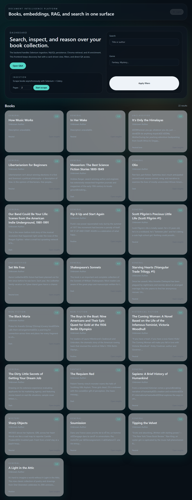
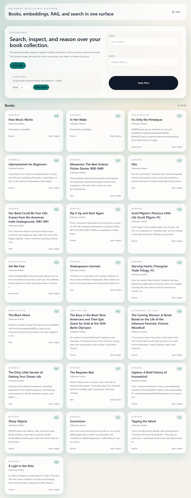
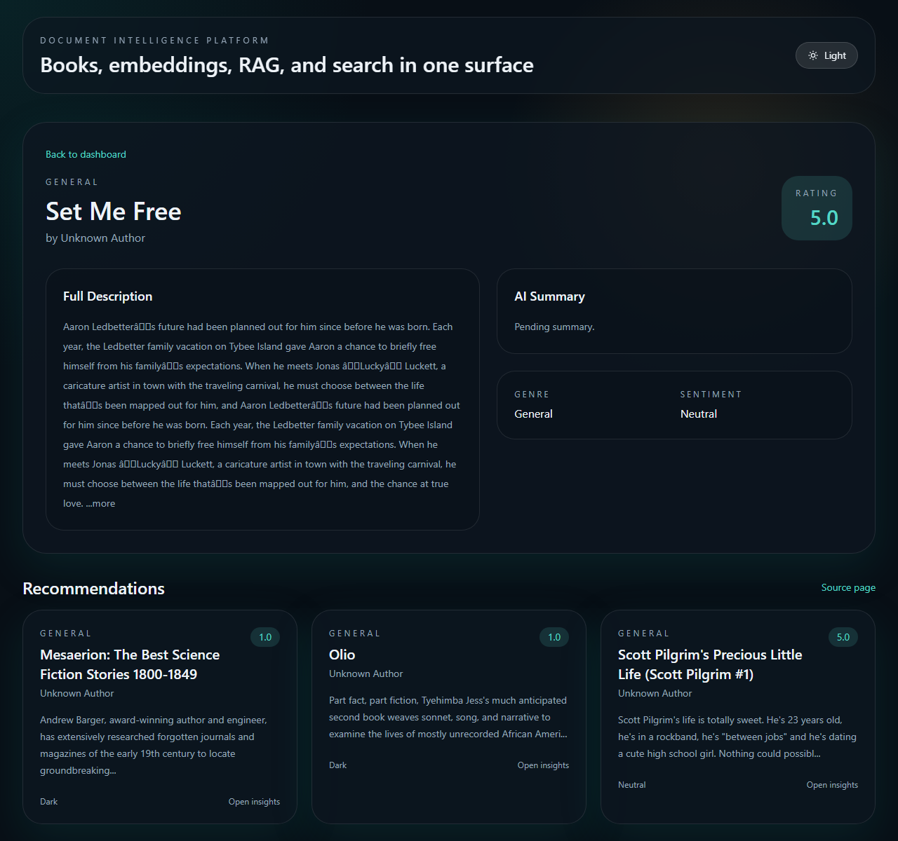
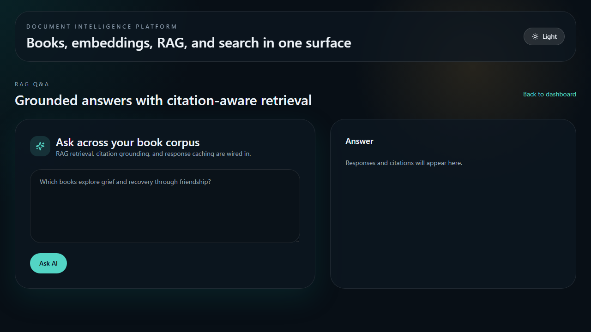

# Book Document Intelligence Platform

Full-stack AI-powered platform for scraping books, indexing semantic chunks, running RAG Q&A, and serving a modern frontend.

## Implemented Scope

### Backend (Django REST Framework)
- `Book`, `BookChunk`, `ChatHistory` models
- APIs:
  - `GET /api/books/`
  - `GET /api/books/{id}/`
  - `GET /api/books/{id}/recommend/`
  - `POST /api/books/upload/`
  - `GET /api/books/upload/{task_id}/status/`
  - `POST /api/query/`
- Full RAG flow:
  - semantic + overlap chunking
  - embedding generation (Gemini/OpenAI/SentenceTransformers)
  - ChromaDB storage + retrieval
  - grounded answer generation with citations
- AI features:
  - summary generation
  - genre classification
  - sentiment analysis
  - recommendation by embedding similarity
  - external author/description enrichment during scraping
- Advanced features:
  - Redis caching
  - Celery background ingestion
  - rate limiting
  - chat history by session ID

### Frontend (Next.js + Tailwind)
- Dashboard with search/filter, cards, and ingestion panel
- Book detail page with summary/genre/sentiment/recommendations
- Q&A page with citations, loading states, and toast status feedback
- Dark mode and responsive layout

### Screenshots
#### Dashboard (Dark)


#### Dashboard (Light)


#### Book Detail


#### Q&A Page


### Infrastructure
- Dockerized multi-service stack:
  - `frontend`
  - `backend`
  - `celery`
  - `mysql`
  - `redis`
  - `selenium` (for scraping)

---

## Run On Any Machine (Docker-First)

### 1. Pull code

```bash
git pull
```

### 2. Prepare docker env

```bash
cp .env.docker.example .env.docker
```

Edit `.env.docker` and set at least:
- `DJANGO_SECRET_KEY`
- `GEMINI_API_KEY` (or OpenAI keys if using OpenAI)
- MySQL creds if you change defaults

### 3. Build and start

```bash
docker compose --env-file .env.docker up --build -d
```

### 4. Check containers

```bash
docker compose ps
```

All should be `running`:
- `dip_mysql`
- `dip_redis`
- `dip_selenium`
- `dip_backend`
- `dip_celery`
- `dip_frontend`

### 5. Open app
- Frontend: `http://localhost:3001`
- API base: `http://localhost:8000/api`

If port 3000 is already in use, Docker compose maps the frontend to host port 3001.

### 6. First data ingestion

```bash
curl -X POST http://localhost:8000/api/books/upload/ \
  -H "Content-Type: application/json" \
  -d "{\"pages\":2}"
```

Capture `task_id`, then monitor:

```bash
curl http://localhost:8000/api/books/upload/<task_id>/status/
```

When status is `SUCCESS`, test books:

```bash
curl http://localhost:8000/api/books/
```

Test RAG:

```bash
curl -X POST http://localhost:8000/api/query/ \
  -H "Content-Type: application/json" \
  -d "{\"question\":\"Which books have hopeful emotional themes?\",\"top_k\":4}"
```

---

## Local Run (Without Docker)

### 1. Environment

```bash
cp .env.example .env
```

Use:
- `DB_ENGINE=sqlite` for quick local run
- or `DB_ENGINE=mysql` if local MySQL is available

Run Redis locally if using Celery/cache in local mode.

### 2. Backend

```bash
python -m venv .venv
# Windows:
.venv\Scripts\activate
pip install -r requirements.txt
cd backend
python manage.py migrate
python manage.py runserver
```

### 3. Celery

```bash
cd backend
celery -A config worker -l info --pool=prefork --concurrency=2 --prefetch-multiplier=1
```

### 4. Frontend

```bash
cd frontend
npm install
npm run dev
```

---

## Provider Configuration

### Gemini

```env
LLM_PROVIDER=gemini
EMBEDDING_PROVIDER=gemini
GEMINI_API_KEY=your_key
GEMINI_CHAT_MODEL=gemini-2.5-flash
GEMINI_EMBEDDING_MODEL=gemini-embedding-001
```

### OpenAI

```env
LLM_PROVIDER=openai
EMBEDDING_PROVIDER=openai
OPENAI_API_KEY=your_key
OPENAI_CHAT_MODEL=gpt-4o-mini
OPENAI_EMBEDDING_MODEL=text-embedding-3-small
```

### Hybrid

```env
LLM_PROVIDER=gemini
EMBEDDING_PROVIDER=sentence-transformers
EMBEDDING_MODEL=sentence-transformers/all-MiniLM-L6-v2
```

---

## API Quick Reference

### GET
- `/api/books/`
- `/api/books/{id}/`
- `/api/books/{id}/recommend/`
- `/api/books/upload/{task_id}/status/`

### POST
- `/api/books/upload/`
```json
{ "pages": 3, "start_url": "https://books.toscrape.com/" }
```
- `/api/query/`
```json
{ "question": "Which books focus on emotional recovery?", "session_id": "optional", "top_k": 4 }
```

---

## Sample Questions and Answers

Use these for demo/testing after ingestion is complete.

1. Question:
  `Which books have a positive emotional tone and themes of resilience?`
  Typical answer shape:
  - concise paragraph answer
  - 2-4 citations with title, author, url, excerpt

2. Question:
  `Recommend books similar to The Requiem Red and explain why.`
  Typical answer shape:
  - recommendation rationale based on retrieved chunk similarity
  - source citations from related books

3. Question:
  `Summarize key themes across non-fiction books in this dataset.`
  Typical answer shape:
  - grouped themes from retrieved sources
  - explicit uncertainty when context is weak

---

## Submission Checklist

- Full stack runs with Docker (`frontend`, `backend`, `celery`, `mysql`, `redis`, `selenium`)
- `requirements.txt` is included
- API docs and example payloads are included in this README
- 4 UI screenshots are included under `docs/screenshots/`
- Sample RAG questions are included
- Environment variables are used for secrets and provider settings

---

## Notes

- Scraper target is `books.toscrape.com` for safe public scraping demos.
- In Docker mode, Selenium is provided by `selenium/standalone-chrome`.
- Chroma data persists via Docker volume (`chroma_data`).
- MySQL data persists via Docker volume (`mysql_data`).

---

## Render Lite (2 Services Only)

If you want the fastest cloud demo setup, deploy only:
- backend (Render Web Service)
- frontend (Render Web Service)

Use backend env vars for simple deployment:

```env
DB_ENGINE=sqlite
CACHE_BACKEND=locmem
CELERY_TASK_ALWAYS_EAGER=True
CELERY_TASK_EAGER_PROPAGATES=True
SELENIUM_REMOTE_URL=
```

This mode avoids separate Celery, Redis, MySQL, and Selenium services.
`/api/books/upload/` still works, but tasks execute inline in the backend process.
